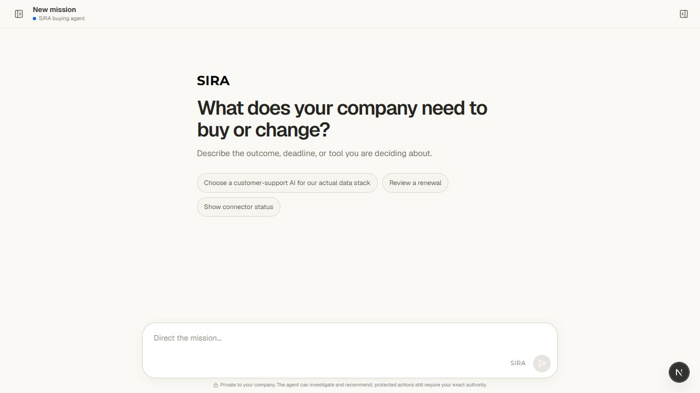
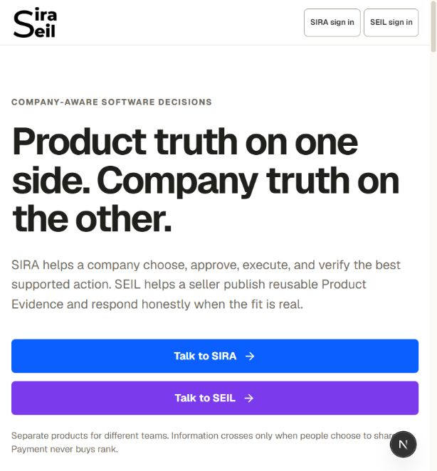
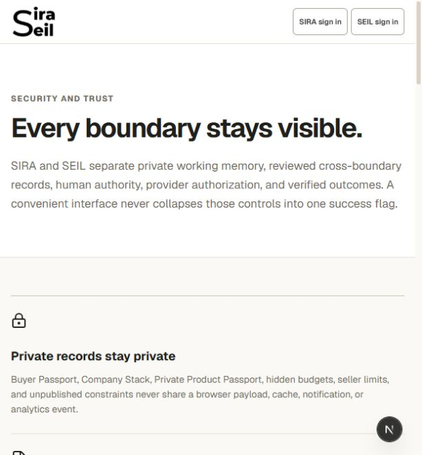
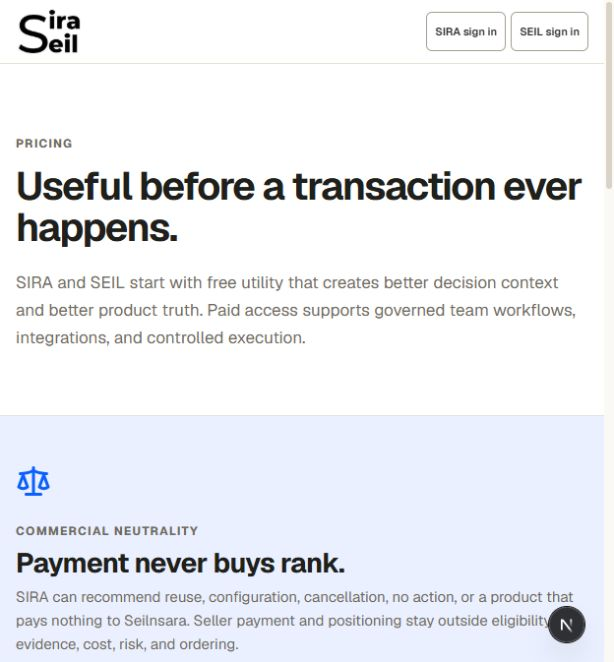
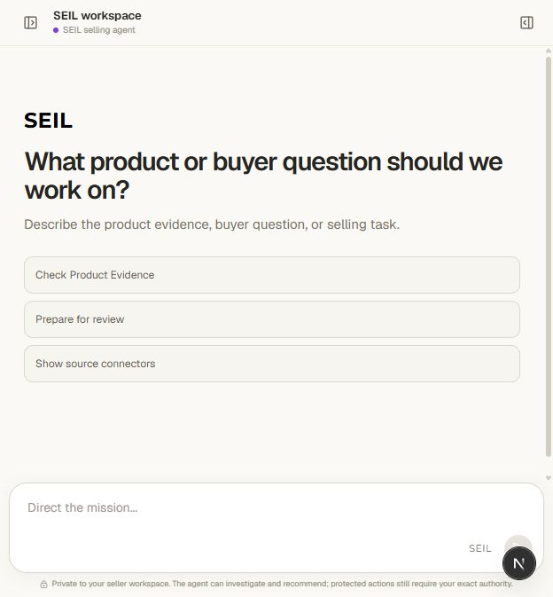
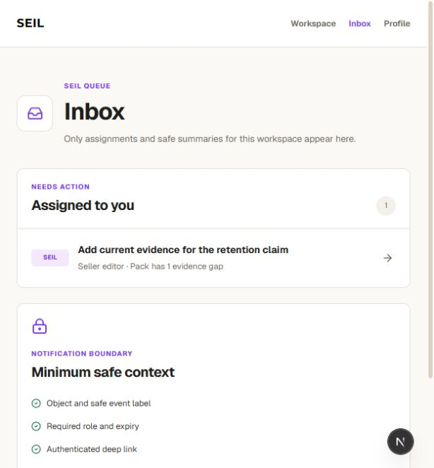
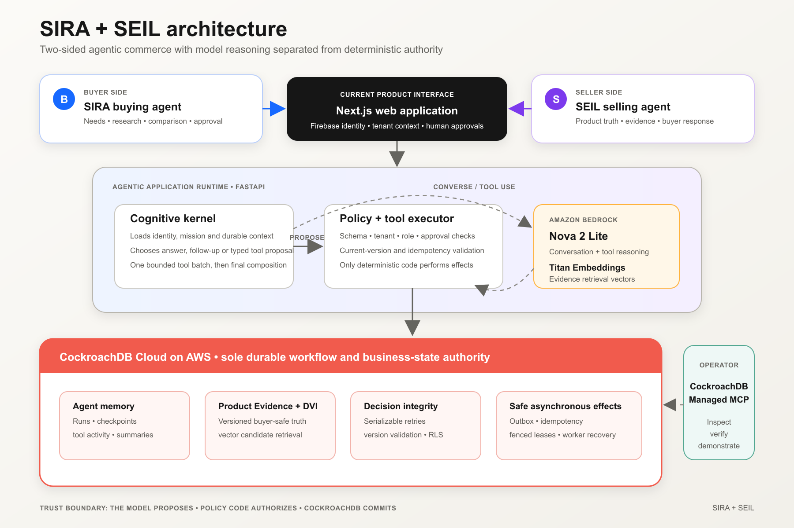

# SIRA + SEIL

**Two company-aware agents for better B2B software decisions.**

SIRA works for the buyer: it investigates a need, compares eligible products, explains the evidence, and asks for approval before protected actions. SEIL works for the seller: it turns product knowledge into reusable, versioned Product Evidence and responds when the fit is real.

CockroachDB is the durable authority that prevents concurrent buyer, seller, and worker activity from producing stale, duplicated, or lost decisions. Amazon Bedrock supplies model reasoning and embeddings; deterministic application code validates every proposed tool call before it can read or change business state.

## Product tour

| SIRA buying mission | Product overview |
| --- | --- |
|  |  |
| Security and trust | Commercial neutrality |
|  |  |
| SEIL seller workspace | Governed seller inbox |
|  |  |

## How it works



1. The Next.js interface sends an authenticated mission to the FastAPI application.
2. The cognitive kernel gives Amazon Bedrock a bounded set of typed tools and relevant CockroachDB-backed context.
3. The model may answer, ask a useful follow-up, or propose tool calls. It cannot execute them directly.
4. Deterministic policy code validates identity, tenant, arguments, approvals, and current versions before executing a proposal.
5. CockroachDB atomically records the run, checkpoints, tool activity, evidence versions, decisions, and outbox effects.
6. The final response is composed from verified tool results and returned in natural language.

CockroachDB is used for more than storage: serializable retries protect concurrent decisions, fenced leases make worker recovery safe, the outbox makes effects idempotent, and Distributed Vector Indexing retrieves candidate evidence without becoming the final eligibility decision. There is no second workflow-state authority.

The runtime uses Amazon Nova through Bedrock for conversation and tool reasoning and Amazon Titan Embeddings for retrieval. AWS task-role-ready infrastructure and isolated SIRA/SEIL runtime definitions are included under [`infra/`](infra/).

See the [architecture decisions](docs/architecture-decisions.md), [threat model](docs/threat-model.md), [tool authoring guide](docs/tool-authoring-guide.md), and [implementation record](docs/flagship-platform-plan.md).

## Run locally

Requirements: Python 3.12+, [`uv`](https://docs.astral.sh/uv/), Node.js 22+, pnpm 11, Docker Desktop (or WSL2), an AWS account with Bedrock model access, and a Firebase project with Anonymous Authentication enabled.

```powershell
git clone https://github.com/sandip-pathe/sira-seil-cockroach-aws.git
cd sira-seil-cockroach-aws
Copy-Item .env.example .env
uv sync --all-extras
corepack pnpm install --frozen-lockfile
```

Fill only the named values in `.env`; never commit credentials. For the functional API-backed experience, set `NEXT_PUBLIC_WEB_DATA_MODE=api`, configure the public Firebase web values, and use an authenticated AWS profile with Bedrock access. The example already contains safe loopback CockroachDB URLs for local development.

```powershell
aws login --profile sira-hackathon
uv run sira-dev doctor --profile local
uv run sira-dev up --profile local
uv run sira-dev status --profile local
```

Open [http://localhost:3000](http://localhost:3000). Choose **SIRA sign in** or **SEIL sign in**, then use the anonymous guest path for an isolated judge session. The API is exposed only on loopback at [http://127.0.0.1:8000](http://127.0.0.1:8000).

`sira-dev up` starts CockroachDB, applies migrations and role grants, checks the configured Bedrock provider, and starts the API and web app. Startup fails if the real cognitive provider cannot pass preflight; the user-facing agent never substitutes a canned answer. Use `uv run sira-dev logs`, `uv run sira-dev check`, and `uv run sira-dev down` for lifecycle operations.

The detailed [setup contract](docs/hackathon-build/SETUP.md), [demo runbook](docs/hackathon-build/demo-runbook.md), and [example environment](.env.example) are included for reproducible judging.

## Verification

```powershell
uv run pytest -q
powershell -ExecutionPolicy Bypass -File scripts/check.ps1
corepack pnpm --dir apps/web build
```

The repository includes unit, contract, security, agent-conversation, and CockroachDB integration coverage. The evidence-race scenario demonstrates that a seller correction invalidates a stale buyer decision while duplicate worker delivery still produces one effect:

```powershell
uv run sira-scenario reset --scenario evidence-race
uv run sira-scenario run --scenario evidence-race
uv run sira-scenario verify --latest
```

## Security boundaries

- Buyer context remains buyer-private.
- Seller drafts remain seller-private; only published buyer-safe projections cross into SIRA.
- Public research is labeled and never silently becomes seller-attested evidence.
- Structured eligibility rules decide fit; vector retrieval only finds candidates.
- Purchase and contract actions require explicit human approval.
- The agent never handles card data or claims payment success; an approved purchase can create an immutable external payment handoff.

## Provenance and license

SIRA and SEIL existed before this hackathon. The CockroachDB state layer, Distributed Vector Indexing, concurrent version validation, worker recovery, Managed MCP inspection path, and AWS agent runtime are the disclosed hackathon work. See [SOURCE_PROVENANCE.md](SOURCE_PROVENANCE.md) for the precise record.

Licensed under [Apache-2.0](LICENSE).
