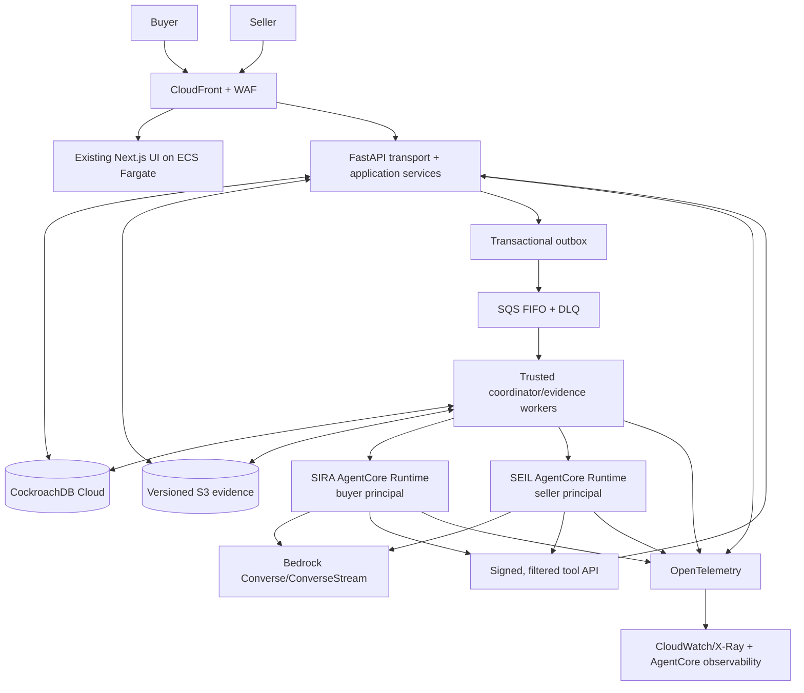
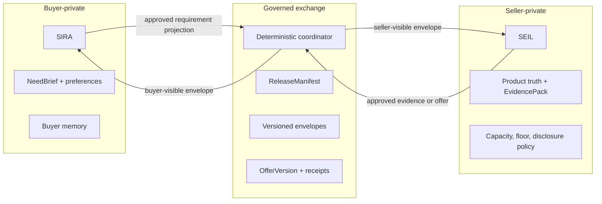

# SIRA + SEIL Flagship Platform — Final Architecture and Implementation Plan

Status: **R1 local core implemented and under final verification; R2 cloud definitions are
implemented but live deployment evidence is blocked on cloud credentials/resources; R3 remains
portfolio hardening.** Last verified locally: 2026-08-18.

The interface is frozen. No visual change is authorized by this plan. The exact boundary and the
approval package required for any future pixel change are recorded in
[`ui-preservation-review.md`](ui-preservation-review.md).

| Release | Current result | Evidence / remaining gate |
|---|---|---|
| R1 local core | Implemented | Fresh Cockroach migrations through `cdb0018`, DVI index, 13 real-Cockroach integration cases, evidence-race scenario, typed SIRA/SEIL kernel, bilateral offer/handoff protocol, and local web/API health passed. Two-browser exchange rehearsal remains a release check, not a UI task. |
| R2 hosted proof | Code and CDK ready; not deployed | Two isolated AgentCore runtimes, ECS web/API/workers, SQS, S3, Secrets, Guardrails, changefeed bridge, alarms, and deployment preflight synth/test. Requires renewed AWS login, Cockroach Cloud URLs, deployment, provider eval, MCP proof, and trace. |
| R3 hardening | Partial | Static quality, credential scan, 424 non-provider tests, web checks, and architecture boundaries passed. Load, chaos, managed restore, five hosted rehearsals, and measured cost/latency remain evidence gates. |

This replaces the earlier platform-wide P0–P9 roadmap. The final scope is one deep, production-shaped bilateral journey through the restored SIRA and SEIL interface. It starts from the code already present instead of treating the repository as greenfield.

## 1. Frozen decisions

1. **SIRA + SEIL remains the product:** a proof-first, two-sided agentic B2B marketplace. SIRA represents the buyer; SEIL represents the seller.
2. **The restored interface is frozen.** Keep its routes, visual identity, layout, typography, spacing, and interaction language. Functional wiring and truthful state/error copy are allowed; a new shell or visual redesign is not.
3. **CockroachDB is authoritative.** Messages, commercial objects, run state, checkpoints, approvals, lineage, idempotency, and effect receipts are durable CockroachDB records.
4. **Models propose; code decides and executes.** Model output cannot directly set durable state, authorize disclosure, rank a winner, consume approval, or claim an effect succeeded.
5. **SIRA and SEIL are separate principals.** They share kernel code, never private context, runtime identity, tool policy, capabilities, or budgets.
6. **Use a small custom agent kernel first.** Do not add LangGraph, Temporal, or another checkpoint authority without measured need.
7. **AWS is used where it fits.** Bedrock provides inference; two AgentCore Runtime deployments eventually host SIRA and SEIL; ECS runs the web, API, and trusted workers.
8. **No payment processing.** V1 ends at a provider-neutral, human-approved contract/payment handoff.
9. **One excellent vertical slice precedes platform breadth.** V1 proves a realistic software-buying case with real evidence and two candidates.
10. **Technical evidence is the deliverable.** Architecture claims must link to code, deterministic tests, evaluations, traces, or hosted measurements.

## 2. Explicit assumptions

- Current SIRA/SEIL routes and the restored UI are the visual baseline.
- Existing CockroachDB, decision-engine, Bedrock, changefeed, AWS CDK, and test work is retained when verified.
- The canonical V1 category is **meeting-intelligence software**, matching the repository's existing evidence and decision fixtures. Additional categories are post-V1 validation.
- Local development works with deterministic provider doubles and no cloud credentials.
- Hosted provider quality is measured separately from deterministic correctness.
- Firebase authenticates people; the server resolves organization, party, roles, and permissions.
- Human approval is required before disclosure, introduction, offer acceptance, or external handoff.
- AgentCore runtimes never receive database credentials.

## 3. Current repository reality

### Existing work to reuse

- CockroachDB migrations through `cdb0011`, forced RLS, transaction-local tenant context, bounded `40001` retry support, vector indexes, and hosted tenant roles.
- Versioned buyer, decision, approval, seller-evidence, marketplace, mission, checkpoint, capability, effect, outbox, qualification, fencing, and changefeed concepts.
- Deterministic gates, bounds, counterfactuals, rank stability, decision graphs, and concurrency/replacement tests.
- Bedrock Converse and embedding adapters, qualification evaluations, S3/SQS/CDK infrastructure,
  ECS web/API/worker services, and separate principal-locked SIRA and SEIL AgentCore runtimes.
- The restored SIRA and SEIL UI, decision and seller-evidence routes, Firebase integration, and generated API contracts.
- Seventy Python test files across unit, property, contract, integration, API, and Cockroach suites.

### Blocking gaps found by review

| Severity | Current evidence | Required correction |
|---|---|---|
| Status | Review finding | Resolution |
|---|---|---|
| Closed | Model-authored mission state and invalid fallback state | `TurnDecision` is a strict discriminated proposal; `RunEngine` owns durable transitions. |
| Closed | Ordinary interactive writes and swallowed continuation failures | Cognitive writes use bounded retryable closures and persist typed safe failures. |
| Closed | Weak authority/tool boundary | Strict tool schemas, principal/party/purpose/stage filtering, budgets, and payload-bound capabilities are implemented. |
| Closed | Legacy checkout execution | Removed; only immutable provider-neutral handoffs remain. |
| Closed | OpenAI runtime as active architecture | `CognitiveRuntime` now selects deterministic local, Bedrock, or AgentCore providers. |
| Closed | One experiment-only AgentCore runtime | CDK defines separate principal-locked SIRA and SEIL runtimes with signed tickets and no database credential. |
| Closed | Bilateral party ownership | Append-only commands, deterministic coordinator, opaque scoped route, and separate tenant projections are implemented. |
| Closed | Missing local command surface | `sira-dev` and `sira-scenario` cover lifecycle and deterministic verification, including WSL2 Cockroach fallback. |
| Open R3 | Large legacy service/UI modules | New backend behavior is isolated behind modules/facades. UI refactoring is prohibited without founder approval. |

This is a control-plane, trust-boundary, and integration refactor—not another database migration and not a UI rebuild.

## 4. Flagship proof

The release is complete only when this works through real contracts without hard-coded dialogue or a hard-coded winner:

1. SIRA greets naturally and explains its role without calling a business tool.
2. A buyer gives an ambiguous goal. SIRA uses authorized private context and asks one material question.
3. SIRA creates a private, versioned `NeedBrief`. The buyer approves a sanitized `RequirementBrief` with recipient, purpose, fields, and expiry.
4. SEIL receives only that projection, ingests real versioned evidence, and publishes an approved `EvidencePack`.
5. SIRA retrieves two candidates and explains hard eligibility, buyer utility, seller feasibility, evidence coverage, uncertainty, citations, and a counterfactual.
6. SEIL publishes contradictory evidence version 2 while an evaluation based on version 1 is active.
7. CockroachDB fences the stale run, prevents a stale decision/effect, and completes exactly one replacement using version 2.
8. SIRA and SEIL exchange one typed offer/counteroffer. A human approves exact terms and opens a provider-neutral handoff.
9. A redacted trace and invariant report prove separate principals, no private-field leakage, actual Bedrock/tool use, durable recovery, and at most one permitted effect.

This is more than chat: natural language controls a durable, evidence-grounded, two-principal transaction protocol.

## 5. Target architecture

### System context



The trusted backend boundary includes API and narrowly scoped workers sharing application services and Cockroach adapters. Workers may hold task-specific roles for leases, checkpoints, outbox, and application commands; they do not issue arbitrary SQL or duplicate business rules. AgentCore runtimes have no database credentials and reach state only through signed typed tools.

### Trust planes



No model invocation receives both private planes. The coordinator handles only compiled exchange payloads and deterministic transitions.

| Model-native | Code-native |
|---|---|
| conversation, interpretation, question wording, research planning, extraction proposals, explanations | identity, tenancy, tool visibility, sufficiency constraints, transitions, eligibility, arithmetic, disclosure, ranking, approvals, retries, effects |

## 6. Agent runtime and harness

Every turn follows one bounded loop:

```text
capture -> assemble -> decide -> authorize -> execute -> checkpoint -> compose
```

1. **Capture:** durably store input and idempotency key before long work.
2. **Assemble:** build a minimal hashed `ContextManifest` from authorized versioned records.
3. **Decide:** Bedrock returns one strict `TurnDecision` variant.
4. **Authorize:** validate principal, purpose, state, schemas, versions, budgets, capability, and approval.
5. **Execute:** run safe reads or one serialized mutation through application services.
6. **Checkpoint:** persist result, transition, and outbox event before another model call.
7. **Compose:** respond naturally only from recorded state and typed results.

Terminal variants are `Respond`, `Clarify`, `ProposeTools`, `RequestApproval`, `WaitForExternal`, `Complete`, and `FailSafely`. The model never returns persistent run-state names for direct storage.

### Runtime invariants

- Ordinary turns allow at most three model calls, four parallel reads, one mutation at a time, and explicit token/cost/time budgets.
- Independent reads may run concurrently; typed results reduce in stable declared order.
- Mutations serialize per aggregate and require `expected_version`.
- Protected effects require an exact, single-use, expiring capability bound to the payload hash.
- Every step is durable before the next begins.
- Resume rebuilds context and revalidates capability, approval, object/policy versions, and context hash.
- Denial is a typed recovery signal, not an exception dumped into chat.
- Specialists get a narrow task, tool set, private subset, and budget; they return a typed artifact and cannot perform effects.

### Tool catalog

Each versioned manifest defines:

```text
name, contract_version, description
allowed_principals, purposes, run_states
input_data_classes, output_data_classes
risk: read | mutation | protected_effect
approval_requirement, capability_scope
concurrency_key, timeout, retry_policy, budget
input_schema, output_schema
```

The broker filters tools before schemas reach the model. Execution rejects extra fields, unknown/stale versions, wrong party/purpose/state, expired grants, and budget overflow. Tool code repeats decisive authorization at the application boundary.

### Why no LangGraph now

The authority graph is small and already needs Cockroach-native transactions, idempotency, checkpoints, and effects. LangGraph persistence would add a second state authority. Reconsider only if implementation yields several reusable branching subgraphs or human-wait flows the kernel cannot express cleanly. Any future checkpointer must adapt to Cockroach records.

Temporal has the same threshold: use it only if long-running external workflows and compensation exceed the tested outbox/state-machine design. It cannot own commercial state.

## 7. Memory and context

| Memory class | Contents | Authority/write rule |
|---|---|---|
| Conversation | append-only user/assistant messages | idempotent capture before processing |
| Working | goal, open questions, plan, budget, run state | code-owned transitions |
| Semantic | buyer requirements/preferences; seller claims/facts | model proposes; validation commits with provenance |
| Episodic | outcome-linked summaries of prior cases/failures | derived only from observed durable records |
| Exchange | released requirements, evidence, offers, consent, receipts | coordinator-owned and projection-specific |

Each invocation receives a `ContextManifest` containing principal/purpose, goal/stage, current turn, bounded recent messages, typed summary, unresolved questions, selected memory references, pinned evidence, authorized exchange projection, filtered tools, approvals/capabilities, budgets, and relevant version/hash values.

Summaries are rebuildable caches, never authority. Memory retrieval is tenant-, party-, purpose-, and time-filtered before semantic ranking. AgentCore Memory is not an authority store. Retention, expiry, revocation, correction, provenance, and sensitivity are first-class. Raw prompts, chain-of-thought, secrets, and unrestricted private context are not logged.

## 8. Evidence, RAG, matching, and negotiation

### Evidence pipeline

```text
upload/fetch -> quarantine/validate -> parse/OCR -> stable spans
-> extraction proposal -> deterministic validation -> embed/index
-> seller review -> publish EvidencePack version
```

- Provider/hosted originals are versioned and encrypted in S3. Local mode uses a filesystem object-store adapter with the same version/checksum contract, so it needs no AWS credentials. Cockroach stores metadata, claims, spans, provenance, chunks, vectors, and publication state in every profile.
- Document text is always untrusted data, never instructions.
- Decisions pin exact evidence and product versions; replacement sources never rewrite history.
- Relational/full-text filters enforce tenant, party, visibility, category, current version, and freshness before Cockroach distributed-vector search.
- V1 uses Titan Text Embeddings V2 in provider/hosted mode and deterministic fixed embeddings locally. Final evidence and citations are recorded.
- Bedrock reranking is excluded by default. Add it only if hybrid retrieval misses the V1 `Recall@5 >= 0.90` gate and reranking improves `MRR@5` by at least 10% without reducing grounding, adding more than $0.05 per completed reference case, or breaching latency.
- Cockroach Cloud Managed MCP is a restricted read-only operator/evaluation surface for schema, run, decision, and effect-lineage inspection. It cannot mutate commercial state.

### Reciprocal matching

The deterministic evaluator applies:

1. hard eligibility gates;
2. evidence authority, coverage, freshness, and contradiction penalties;
3. buyer utility per criterion;
4. seller feasibility and supported-fit per criterion;
5. uncertainty intervals and rank stability;
6. Pareto frontier and deterministic tie-break;
7. strongest counterfactual and highest-value missing fact.

Embeddings retrieve candidates; an LLM may explain a recorded evaluation; neither selects the winner. Clarification uses expected decision value and is asked only when it could materially change eligibility, rank, disclosure, or execution.

### Negotiation

V1 implements 1:1 negotiation with immutable `OfferVersion` records:

```text
DRAFT -> PROPOSED -> COUNTERED -> AGREED_PENDING_APPROVAL
                         \-> WITHDRAWN | EXPIRED | REJECTED
AGREED_PENDING_APPROVAL -> APPROVED_FOR_HANDOFF | REJECTED | EXPIRED
```

Every version records proposer, recipient, predecessor, changed terms, rationale, expiry, constraint impact, evidence/requirement hashes, and approval status. Buyer reservation values and seller floors never enter exchange projections. A deterministic verifier checks feasibility, arithmetic, party ownership, bounds, freshness, and approval binding.

Evaluation covers sequential/simultaneous rounds, timeouts, near misses, cross-play between model/config versions, private-value canaries, convergence, buyer/seller utility, welfare, feasibility, cost, latency, and overflow. V1 gates on 1:1; 1:N and N:N remain later research suites.

## 9. CockroachDB authority model

Reuse/evolve existing tables; do not create a parallel subsystem. Target concepts:

- messages, runs, steps/events, checkpoints, tool calls/results;
- versioned need briefs, requirement briefs, release manifests;
- seller products, source versions, claims, chunks/vectors, evidence packs;
- match inputs/evaluations/counterfactuals/dependency edges;
- exchange cases, party projections, envelopes, receipts;
- immutable offers, approvals, capabilities;
- effect reservations, acknowledgements, reconciliations, outbox.

Existing mission tables may migrate to these contracts; never dual-write two authorities.

### Transaction rules

- Every mutation is a database-only retryable closure. Model/provider/network calls occur outside it behind an outbox or reservation.
- Every command has an idempotency key and expected aggregate version.
- Leased work carries a generation/fencing token checked again at commit.
- Effect uniqueness is constrained by business idempotency key.
- Changefeeds are invalidation hints; correctness cannot depend on delivery.
- RLS is defense in depth. The boundary combines authenticated server context, application authorization, unexposed credentials, parameterized SQL, grants, and forced RLS.
- Pool-reuse tests prove transaction-local tenant context cannot leak.

## 10. Identity, security, and privacy

- Firebase verifies the human token; server code maps membership, party, roles, purpose, and step-up status.
- Guest access uses one isolated synthetic judge tenant, bounded quotas, no effects, and no path to another tenant.
- Services use distinct API, coordinator, evidence-worker, outbox, directory-reader, migration, SIRA-runtime, and SEIL-runtime roles.
- Runtime tickets are short-lived, signed, audience/purpose-bound, and replay-protected.
- Cross-party data moves only through a `ReleaseManifest`: recipient, purpose, fields, transformations, source versions, expiry, approval, and hash.
- Error text, counts, search, cache keys, vectors, telemetry, and timing copy are leakage-test surfaces.
- Capabilities bind effect type, exact fields, target, amount/terms, object versions, payload hash, expiry, max use, and actor.
- Handoffs use allowlisted HTTPS and signed state; returned status is `UNKNOWN` until independently verified.
- Prompt injection, SSRF, document bombs, unsafe types, secrets, PII, and malicious tool output have deterministic rejection/redaction paths.

## 11. AWS topology

Use the existing CDK stack as the base and remove decorative/unneeded resources during implementation.

- CloudFront/WAF -> private ALB -> ECS Fargate web/API.
- ECS coordinator/evidence/outbox workers with task-specific IAM and SQS FIFO/DLQs.
- Two custom AgentCore Runtime deployments from one kernel image but separate identities, prompts, manifests, policies, endpoints, and budgets.
- Bedrock Converse/ConverseStream with native structured output/strict tools and Titan Text Embeddings V2 for provider/hosted retrieval.
- Versioned SSE-KMS S3, Secrets Manager, CloudWatch/X-Ray/OpenTelemetry, image scanning, alarms, canary, and rollback.
- CockroachDB Cloud in the same AWS region for V1; multi-region is deferred until measured requirements justify it.
- V1 uses signed FastAPI tool contracts as the authority boundary. AgentCore Gateway/Policy is deferred; it may be proposed later only if it demonstrably denies the real tool path without duplicating application policy.
- No Amplify for the current Next server, Bedrock Agents Classic, Kubernetes, Snowflake, SageMaker, or checkbox service.

## 12. UI integration rules

### Frozen visual boundary

- Preserve current SIRA, SEIL, decision, evidence, inbox, profile, sign-in, and public routes.
- Preserve shell, color, type, spacing, motion, and component primitives.
- All new states must use existing routes and existing visual component primitives. Refactor large components only behind visual regression snapshots and route browser checks after every slice, not just S0.
- Do not create a replacement shell, alternate UI, archived experiment route, or new design system.

### Functional states using existing components

- private `NeedBrief` summary/edit action;
- disclosure preview with recipient, purpose, fields, transformations, expiry, approval;
- SEIL evidence receipt and missing-evidence request;
- reciprocal comparison and cited exclusion/counterfactual detail;
- stale-result notice stating what changed and remains valid;
- exact offer/handoff confirmation;
- user-safe “What happened” in the current info drawer.

Replace normal-user `mission`, `runtime state`, `tools called`, and `saved checkpoint` with `conversation`, `decision`, `work completed`, and natural recovery language. Technical state belongs only in a redacted operator trace. Progress comes from durable backend events, not timers.

### UI acceptance

- Greetings call no business tool; incomplete context produces one material question.
- Two browser identities see different correct projections of the same case.
- Disclosure/handoff controls show exact confirmation before authority.
- No prompt, tool identifier, internal state, stack trace, private-field count, or opposing-party detail appears normally.
- Assistant messages are announced without flooding screen readers; dialogs/drawers manage focus and return.
- Controls are keyboard-complete, non-color-dependent, reduced-motion safe, and usable at 320 px.
- Handoff never implies payment completion.

## 13. Failure and recovery registry

| Failure | Deterministic handling | User result |
|---|---|---|
| Duplicate submit | return original run by idempotency key | one turn |
| Dispatch lost after commit | outbox sweeper republishes | work remains queued |
| Cockroach `40001` | retry database-only closure | invisible or safe typed failure |
| Worker/runtime death | lease expires; next generation resumes; stale commit fenced | confirmed work remains saved |
| Malformed model output | reject schema; bounded retry | natural recovery; no partial state |
| Tool denied | typed denial with safe options | request authority or choose alternative |
| Tool timeout | state-specific retry/cancel | completed work remains saved |
| Out-of-order read result | ordered reducer and step/version check | no stale composition |
| Evidence changes mid-run | pin old version; invalidate; one replacement | comparison refreshes visibly |
| Offer/approval changes | hash/version mismatch invalidates capability | exact changed terms shown |
| Duplicate/ambiguous effect | unique reservation; `UNCERTAIN` then reconcile | never claim success early |
| Consent revoked | block release; expire projection; retain receipt | current access is explicit |
| Vector index unavailable | relational gates + degraded recall | label search incomplete |
| AgentCore/Bedrock unavailable | durable queued run and bounded retry | no lost input/fixture fallback |

## 14. Implementation sequence

Each slice is mergeable, leaves the current UI usable, and has a blocking evidence gate.

Delivery is split into three releases so “one vertical slice” does not become one unbounded launch:

- **R1 — Local core (S0–S4):** the complete bilateral protocol, deterministic providers, real local CockroachDB, and preserved UI.
- **R2 — Hosted proof (S5):** Bedrock, two AgentCore runtimes, Cockroach Cloud, AWS infrastructure, Managed MCP verification, and one distributed trace.
- **R3 — Portfolio hardening (S6):** load, chaos, disaster recovery, final modularization, and published evidence. R3 is not allowed to delay an honest R1/R2 demonstration.

### S0 — Truthful baseline and engineering kernel

Build:

- record visual snapshots and route/API characterization for restored UI;
- fix invalid `EVALUATING` and add producer/consumer contract tests;
- remove every active checkout-provider path and add only `PaymentHandoff`;
- implement `sira-dev doctor|up|status|logs|check|down` and `sira-scenario reset|run|verify`;
- start Cockroach, migrations, API, worker, and web locally with explicit profiles;
- add PR CI for Python, web, contracts, Cockroach, browser, security, and CDK;
- freeze module rules, state/tool contracts, trust planes, and canonical scenarios.
- check in `evaluations/thresholds.v1.yaml` with the numeric gates in section 15; changing a threshold requires an ADR and founder approval rather than silently moving the gate.

Gate:

- clean Windows/Ubuntu clones run the deterministic scenario;
- no legacy checkout-provider symbol, route, table, environment key, UI, or document remains;
- UI snapshots match the restored baseline;
- intentional boundary/contract drift fails CI;
- local mode needs no cloud credentials and cannot perform external effects.

### S1 — Durable contextual runtime seam

Build:

- add `CognitiveRuntime`, `TurnDecision`, `ContextManifest`, `RunEngine`, `ToolBroker`, `ResponseComposer`, budgets, and typed failures;
- persist input, run, step, checkpoint, tool request/result, and user events;
- route one existing SIRA and one SEIL path through the kernel behind a local/test-only flag; hosted/production activation remains impossible until S2 isolation passes;
- use deterministic fake by default; add Bedrock structured-output parity separately;
- replace silent failure and ordinary mission writes with durable events/retryable commands;
- project user-safe states into unchanged UI.

Gate:

- greeting, explanation, ambiguity, clarification, response, read, malformed output, timeout, denial, cancel, duplicate, and resume scenarios pass;
- model output cannot set persistent state or create records directly;
- valid commands survive forced `40001`;
- normal UI contains no internal runtime vocabulary.
- production configuration rejects the new kernel flag until the S2 isolation contract is present and enabled.

### S2 — Principal, party, and tool isolation

Build:

- resolve membership/party/purpose server-side;
- separate SIRA/SEIL tickets, context selectors, manifests, policies, and budgets;
- enforce manifest filtering and exact capabilities;
- replace bilateral updates with append-only party commands, coordinator transitions, and separate projections;
- split SQL roles and test pooled-connection reuse;
- implement isolated guest judge tenant.

Gate:

- SIRA/SEIL cannot request each other’s private tools;
- tenant, party, cache, count, search, error, telemetry, vector, and session leakage tests pass;
- neither runtime has DB credentials;
- extra fields, stale versions, wrong purpose/state, and expired grants fail closed.

### S3 — Real evidence, RAG, and reciprocal evaluation

Build:

- ingest a small real versioned corpus through the object-store port: filesystem locally, S3 in provider/hosted mode, with claims/spans/chunks in Cockroach;
- add validation, review, publication, contradiction, expiry, and dependency edges;
- implement authorized hybrid full-text/DVI retrieval, fixed local embeddings, Titan provider embeddings, and pinned contexts; keep reranking off unless its stated adoption trigger fires;
- extend current gates/bounds/counterfactuals/rank stability with seller feasibility/support and uncertainty;
- select high-value clarification deterministically;
- wire citations, gaps, reciprocal comparison, and stale copy into existing UI.

Gate:

- every decision-material claim links exact source/version/span;
- unauthorized chunks are excluded before semantic search;
- same inputs produce same eligibility/ranking bounds;
- missing material data triggers one valuable question and measurable change;
- the frozen numeric retrieval, citation, grounding, contradiction, leakage, and stability thresholds pass.

### S4 — Bilateral protocol, offer, handoff, and race proof

Build:

- implement `ReleaseManifest`, envelopes, receipts, sequence/causation, expiry, revocation;
- complete buyer requirement -> seller evidence -> buyer re-evaluation;
- implement `OfferVersion`, deterministic feasibility/utility, private-value boundaries, and 1:1 counteroffers;
- bind human approval to current offer/payload hash;
- reserve one provider-neutral handoff transactionally;
- add evidence-v1/v2 race, duplicates, worker death, and resume scenarios.

Gate:

- two browsers complete the bilateral path with distinct projections;
- private fields/reservation values never cross;
- stale, replayed, expired, unauthorized, extra-field, wrong-party, and changed-term offers fail;
- 100 races yield one current decision, one replacement, and at most one effect;
- handoff shows exact terms and cannot report payment success.

### S5 — Bedrock and two AgentCore runtimes on AWS

Build:

- pass every kernel/tool contract against Bedrock provider mode;
- replace experiment-only AgentCore with separate SIRA/SEIL custom runtimes;
- give each distinct IAM, endpoint, prompt/tool bundle, policy, and budget;
- route all state through signed FastAPI tools; leave AgentCore Gateway/Policy out of V1;
- finish ECS/SQS/S3/Secrets/telemetry/alarms/canary/rollback and same-region Cockroach;
- trace browser -> API -> Cockroach -> outbox -> worker -> AgentCore -> Bedrock -> tool -> response.
- configure Cockroach Cloud Managed MCP with a dedicated read-only identity and restricted diagnostic views; add `sira-scenario verify evidence-race --mcp` to compare run, decision, replacement, and effect lineage.

Gate:

- hosted path invokes correct role runtime/model;
- IAM/network tests prove allowed reachability only;
- provider failure preserves input/checkpoint without fixtures;
- Bedrock structure, agent quality, latency, token, cost, and recovery meet the frozen V1 thresholds;
- MCP verification matches API/invariant results, exposes no unrestricted private payload, and a mutation attempt is denied;
- canary rollback loses no run.

### S6 — Release evidence and legacy removal

Build:

- remove OpenAI runtime, keyword/greeting dispatch, model-authored missions, duplicate schemas, and production fixtures after parity;
- split monoliths internally without visual change;
- finish accessibility, privacy, load, chaos, migration/rollback, restore, and DR checks;
- publish concise ADRs, threat model, tool/migration guides, runbooks, evals, cost/latency report, and redacted trace;
- rehearse deterministic local and truthful hosted cases.

Gate:

- five hosted rehearsals pass identical invariants;
- setup, CI, browser privacy/accessibility, migration, recovery, canary, and rollback pass;
- no obsolete payment/provider/runtime remains;
- every portfolio claim links to executable/measured evidence.

## 15. Test and evaluation matrix

### Frozen V1 thresholds

- deterministic authority, transition, tenant/party leakage, disclosure, eligibility, approval, and effect invariants: **100% pass**;
- conversation/tool behavior: **>= 90% task success across at least 50 labelled turns**, with **0** business-tool calls on greeting-only cases and **100%** focused-question compliance when a material field is missing;
- retrieval: `Recall@5 >= 0.90`, `MRR@5 >= 0.80`, citation precision `>= 0.98`, grounded-claim support `>= 0.95`, and unauthorized retrievals `= 0`;
- matching: hard-gate accuracy `= 1.00`, deterministic replay `= 100%`, private-value leakage `= 0`, and stable ordering under irrelevant candidate permutation `= 100%`;
- Bedrock structured-output validity: `>= 0.99` across at least 100 provider turns; safety invariants remain `1.00`;
- performance: turn acceptance p95 `<= 500 ms`, first durable progress p95 `<= 1 s`, simple respond/clarify p95 `<= 8 s`, and full two-candidate comparison p95 `<= 60 s` in hosted staging;
- model cost: `<= $0.50` for the complete nine-step reference case under the pinned model/configuration;
- browser accessibility: zero critical/serious automated violations on canonical desktop/mobile routes, plus keyboard and screen-reader manual checks;
- concurrency: 100 evidence-change races with one current decision, one direct replacement, and at most one permitted effect.

If a threshold proves unrealistic, the gate stays red until an ADR explains the evidence and the founder approves a versioned threshold change.

| Layer | Required cases | Release rule |
|---|---|---|
| Conversation | greeting, capabilities, ambiguity, context reuse, focused question, natural failure | no keyword matching/unneeded tools |
| Decision kernel | every decision, invalid transition, malformed schema, budgets, cancel/resume | deterministic invariants pass |
| Tools/authority | filtering, extra fields, wrong party/purpose/state, stale versions, expired/replayed grant | fail closed with recovery |
| Memory/context | bounded manifest, summary rebuild, correction, expiry, unauthorized recall | no authority/privacy drift |
| Evidence/RAG | recall, precision, citations, freshness, contradictions, injection, leakage | thresholded corpus report |
| Matching | gates, feasibility, utility, uncertainty, ties, counterfactual, stability | deterministic and cited |
| Negotiation | sequential/simultaneous 1:1, timeout, near miss, cross-play, canaries, welfare, stale offer | no hidden leakage; exact binding |
| Cockroach | fresh/upgrade migration, RLS reuse, `40001`, fencing, duplicates, reorder, invalidation, unique effect | real-DB checks required |
| Browser | preserved visuals, projections, disclosure, comparison, recovery, handoff, 320 px, keyboard, screen reader | canonical E2E required |
| Providers | Bedrock structure/grounding/refusal/latency/cost; AgentCore identity/recovery | nightly/manual separate report |
| Infrastructure | images, CDK build/test/synth, IAM/network/storage, canary/rollback | required before hosted release |

Model quality and deterministic correctness remain separate. Tests assert contracts, citations, transitions, policy decisions, hashes, and effects—not chain-of-thought or prose snapshots.

## 16. Developer and operator experience

Minimum commands:

```text
sira-dev doctor|up|status|logs|check|down
sira-scenario reset|run|verify evidence-race
```

| Profile | Providers | Credentials | Effects |
|---|---|---|---|
| `local` | deterministic model/embedding/handoff + filesystem object store | none | none |
| `provider` | local app + Bedrock/Titan/S3 adapters | named AWS profile | sandbox policy only |
| `hosted` | AWS + Cockroach Cloud | workload identity/secrets | exact policy and approval |

Targets:

- clean Windows/Ubuntu clone to local scenario: under 15 minutes;
- warm rerun: under 2 minutes;
- safe trace from one ID: under 30 seconds;
- add typed tool plus success/denial tests: under 30 minutes without transport edits;
- fast PR gate: under 10 minutes; full non-provider matrix: under 25;
- fresh and previous-supported-head migrations pass;
- zero forbidden imports and no new feature logic in legacy monoliths.

Required docs: truthful README, one architecture/runtime document, one tool-authoring guide, one migration guide, and an error/runbook index. Retire or mark conflicting hackathon setup docs.

## 17. Deferred work and triggers

Do not build in the flagship release:

- new UI shell/design system/page expansion/workflow designer;
- 1:N/N:N production negotiation before 1:1 semantics/leakage pass;
- learned ranking/outcome optimization before unbiased longitudinal data;
- payment processing or autonomous purchase execution;
- public SDK/plugin marketplace or A2A/UCP/AP2 adapters;
- LangGraph, Temporal, AgentCore Memory authority, graph DB, Kafka, Snowflake, SageMaker, Kubernetes, microservice sprawl, or multi-region Cockroach without measured need;
- multiple demo categories before the reference case is excellent.

Future work must name a measured trigger, current limitation, migration path, and preserved authority boundary.

## 18. Flagship evidence package

- live two-browser app and five-minute architecture walkthrough;
- ADRs for runtime, Cockroach authority, principals, tool policy, exchange, and no-LangGraph decision;
- threat model plus executable tenant/party/disclosure/effect tests;
- decision/tool/envelope/offer schemas;
- evidence/RAG and reciprocal-matching reports;
- 1:1 negotiation cross-play/private-leakage report;
- Cockroach retry/fencing/invalidation race artifact;
- one redacted distributed trace;
- latency, throughput, token, and cost measurements;
- migration, rollback, restore, and canary evidence;
- deterministic local reproduction and hosted-provider proof;
- precise provenance and honest limitations.

## GSTACK REVIEW REPORT

| Review | Trigger | Why | Runs | Status | Findings |
|---|---|---|---:|---|---|
| Office Hours / CEO | `/office-hours`, `/autoplan` | Premise and 10-star proof | 2 | CLEAR | Reduced platform rewrite to one causal bilateral proof while retaining the founder-approved technical premise |
| Independent challenge | isolated reviewer agents | Second-opinion checks | 5 | CLEAR | CEO, design, engineering, DX, and final adversarial reviewers resolved scope, UI, runtime, threshold, and sequencing defects |
| Design Review | `/autoplan` | Preserve UI and clarify agent behavior | 1 | CLEAR | Readiness 5/10 -> target 9/10; no redesign, only existing-component wiring/truthful states |
| Engineering Review | `/autoplan` | Architecture, failures, tests | 1 | CLEAR WITH GATES | Typed kernel replaces model-authored state; corrected worker boundary; reduced P0–P9 to S0–S6 |
| DX Review | `/autoplan` | Reproducible build/operation | 1 | CLEAR WITH GATES | Required real local commands, app CI, contracts, trace reconstruction, and module rules |
| Karpathy simplification | `/karpathy-guidelines` | Minimality and verifiability | 1 | CLEAR | Removed speculative services/pages, stated assumptions, and gated every slice |

The installed gstack package did not contain the optional `review-sections.md`, `design-and-handoff.md`, or DX Hall-of-Fame appendices referenced by its generated skills. The complete available instructions, repository evidence, prior founder decisions, and isolated reviewers were used; no cross-model diversity is claimed.

**VERDICT:** CEO + DESIGN + ENGINEERING + DX CLEARED — ready to implement S0; every later slice remains evidence-gated.

NO UNRESOLVED DECISIONS
