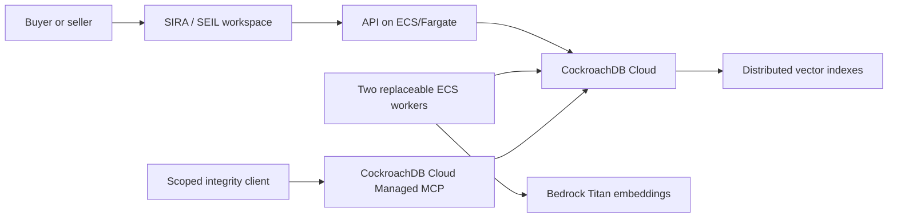

# SIRA + SEIL CockroachDB x AWS master plan

Status: active implementation, reset to repository truth on 2026-08-13.

## Locked direction

SIRA and SEIL remain the product.

- SIRA helps a company choose software using its needs, constraints, and current stack.
- SEIL helps vendors publish accurate product evidence and keeps public research visibly separate.
- CockroachDB prevents stale, duplicated, or lost buying decisions while buyer, seller, research, and worker agents operate concurrently.
- AWS runs the API/workers and Bedrock embeddings.
- CockroachDB Cloud Managed MCP gives judges an independent, scoped integrity check.
- PRAVA is optional payment decoration after human approval, not the core architecture.

No memory rebrand. No separate proof product. No decorative sponsor integration.

## Current repository truth

Completed and pushed:

1. Original August history restored without manufacturing commit dates.
2. Canonical private repository created: `sandip-pathe/sira-seil-cockroach-aws`.
3. Original imported commit remains an ancestor of `main`.
4. `cockroachdb-hackathon-start` marks the current hackathon boundary.
5. The abandoned `cockroach-build` side repository was deleted.
6. DataHub, Senso, Snowflake, Temporal, PRAVA MCP/OAuth, old PostgreSQL Compose/bootstrap runtime, imported PostgreSQL migrations, old submission artifacts, and their generated API/UI surfaces were removed.
7. Cleanup commit `f8db5e8` was pushed to `origin/main`.
8. Web lint/typecheck/client generation and Python lint pass. The remaining decision-fixture test drift predates the Cockroach migration and is tracked separately.

Not implemented yet:

- CockroachDB runtime connection or fresh schema;
- vector indexes or stored Bedrock embeddings;
- SQLSTATE `40001` retry helper;
- version-race invalidation and replacement attempts;
- Cockroach-backed worker leasing/fencing/checkpoints;
- Cockroach Cloud cluster or Managed MCP credentials;
- ECS/Fargate deployment or hosted evidence.

The root application is intentionally between persistence runtimes after cleanup. No deleted side-demo result counts as implementation evidence.

## The judge moment

SIRA snapshots a lower-cost product's v1 claim that EU hosting is available. While evaluation is in progress, SEIL publishes v2 correcting the product to US-only.

| Item | v1 snapshot | v2 current state |
|---|---|---|
| Seller claim | EU hosting available | US-only hosting |
| Buyer requirement | EU hosting required | EU hosting required |
| Lower-cost option | Eligible and would win on price | Blocked |
| Stale attempt | Must emit no decision | Preserved as invalidated |
| Final result | Not allowed | One replacement decision using v2 |

Then the active worker stops, a standby resumes from a durable checkpoint, and replaying the same event still produces one effect and one final decision.

## Architecture target

Application transactions use the SQL driver. MCP is an external integrity path, not the normal runtime.

## Remaining execution order

1. **Compatibility:** local Cockroach container, driver/dialect, fresh migration, RLS, JSON/UUID, vector, retry, and fencing spike.
2. **State:** minimal immutable buyer/seller/catalog/mission schema and repository boundaries.
3. **Retrieval:** real Bedrock embeddings, separate context/catalog vector indexes, freshness checks, and deterministic gates.
4. **Correctness:** mixed-version invalidation, one replacement, one decision, durable checkpoints, fencing, and duplicate suppression.
5. **Product:** real APIs and existing SIRA/SEIL UI states against CockroachDB; keep PRAVA optional and human-approved.
6. **Hosting:** CockroachDB Cloud plus API and two workers on ECS/Fargate with task roles and managed secrets.
7. **Independent proof:** real Cloud MCP five-invariant verdict, hosted repeatability, evidence bundle, and Devpost handoff.

The exact acceptance commands are in `checklist.md`.

## Correctness protocol

1. A short serializable transaction records exact source IDs, versions, and hashes.
2. Retrieval, Bedrock calls, and evaluation happen outside database transactions.
3. A fresh short transaction checks current source heads and the worker fencing token.
4. A source mismatch invalidates the old attempt and inserts or reads one unique replacement.
5. SQLSTATE `40001` retries the whole transaction callback with a fresh session.
6. Database uniqueness enforces one replacement per stale attempt, one effect per idempotency key, and one decision per mission.

## Scope cuts

Required: CockroachDB Cloud, Distributed Vector Indexing, Cloud Managed MCP, Bedrock, ECS/Fargate, concurrency/recovery evidence, and the real SIRA/SEIL workspace.

Deferred until the hosted proof is green: changefeeds, Lambda, Agent Skill contribution, multi-region claims, live web discovery, general event-platform work, and broad payment automation.

## Main risks

| Risk | Mitigation |
|---|---|
| Existing SQLAlchemy code assumes PostgreSQL behavior | Prove a minimal Cockroach slice before porting application repositories |
| Cleanup removed the database runtime | Add a fresh Cockroach-only Compose and migration baseline before feature work |
| App looks like generic RAG | Make the seller correction change a structured eligibility result |
| Vector similarity becomes authority | Rejoin current rows and run deterministic gates after retrieval |
| Worker recovery is cosmetic | Stop a real worker and reject the stale fencing token |
| MCP is decorative | Return an external five-invariant verdict over the exact live mission |
| Reused project history confuses judges | Keep original history and disclose the boundary and pre-existing product plainly |
| Optional work dilutes the core | Do not begin optional items before the hosted proof passes |

## Completion definition

The build is ready only when:

1. v2 changes a real eligibility decision;
2. the stale attempt emits no decision;
3. a standby worker resumes durable work;
4. duplicate replay creates one effect;
5. the final explanation cites current versions;
6. real Bedrock vectors and Cockroach vector retrieval are visible in evidence;
7. external Cloud MCP returns `PASS` for all five invariants;
8. the hosted product runs consistently with no fixture fallback;
9. a buyer understands why the recommendation changed before seeing infrastructure details.
