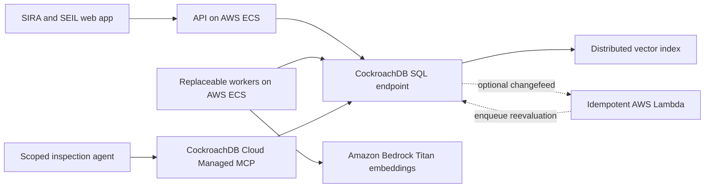

# Technical specification — SIRA + SEIL on CockroachDB and AWS

Status: draft for review  
Date: 2026-08-12  
Source product boundary: tag `cockroachdb-hackathon-start`; active cleanup commit `f8db5e8`

## 1. Technical claim

SIRA and SEIL share versioned buyer context, seller evidence, public research, mission state, and decisions in CockroachDB. CockroachDB is causal to the result because it prevents an evaluation from completing against a mixture of evidence versions and lets another worker resume the same mission after failure.

The SQL driver runs the application. Distributed Vector Indexing retrieves candidates. The Cloud Managed MCP Server provides a scoped, judge-visible inspection path. AWS runs the agents and creates embeddings.

## 2. Reuse boundary

Keep and adapt:

- SIRA and SEIL workspaces;
- mission, checkpoint, event, effect, and outbox concepts;
- seller-published and research-only evidence origins;
- deterministic eligibility and ranking logic;
- buyer/seller authority boundaries;
- API contracts that are not DataHub-specific.

Replace or remove for the hackathon path:

- PostgreSQL-specific connection and migration assumptions;
- DataHub proof, mutation, receipt, and `/proof` surfaces;
- Snowflake-specific flows;
- fixture fallback in hosted mode;
- any winner text that is not computed from stored inputs.

Work in the current canonical repository and use `provenance.md` as the reuse/new-work ledger.

## 3. System shape



### Runtime responsibilities

| Component | Responsibility | Must not do |
|---|---|---|
| Web app | Collect missions, publish seller packs, show decisions and reliability states | Decide authority from agent text |
| API | Authenticate, enforce tenant scope, start missions, read results | Hold a database transaction open across model or web calls |
| Worker | Retrieve, embed, evaluate, checkpoint, and finalize | Finalize after losing its fencing token |
| CockroachDB | Authoritative versions, snapshots, leases, events, effects, decisions, vectors | Defer correctness to an in-memory queue |
| Bedrock | Produce embeddings | Decide product eligibility |
| Cloud MCP | Bounded live inspection using a scoped identity | Carry normal application traffic |
| Optional Lambda | Consume a changefeed and request reevaluation | Assume changefeed delivery is exactly once |

### Module and PRD mapping

```text
apps/web                         E1-E4 / FR13
python/sira_core/catalog         E1-E2 / FR2-FR4
python/sira_core/decision        E1-E2 / FR5-FR6, FR9
python/sira_core/missions        E2-E3 / FR6-FR8
python/cockroach                 FR4-FR8 / tenancy, retries, schema
services/api                     E1-E2 / FR1-FR3, FR9, FR12
services/worker                  E2-E3 / FR4-FR8
tools/integrity                  E4 / FR10
tests                            every acceptance path
```

`WorkspaceService` is not migrated into the Cockroach path as one unit. Its reusable behavior is split across the catalog, decision, mission, and API modules above.

### Request flow

1. API authenticates the actor and creates a mission.
2. A worker captures immutable current-version references in CockroachDB.
3. The worker retrieves context/catalog candidates and calls Bedrock outside a transaction.
4. SEIL may publish a new public catalog version concurrently.
5. Finalization validates the source heads and fencing token in a fresh serializable transaction.
6. On mismatch, the old attempt is invalidated and one replacement starts; otherwise one decision/effect commits.
7. SIRA reads the decision through the API. The external MCP client independently inspects the same stored mission.

## 4. Data model

Names may be adapted to the existing models, but these invariants are fixed.

### Organizations and authority

`organizations`

- `id UUID PRIMARY KEY`
- `name STRING`
- timestamps

Every tenant-owned row includes `organization_id`. Row-level policies and server-side authorization enforce buyer-private, seller-private, and published-projection boundaries.

### Minimal versioned state

Do not port the existing 2,400-line schema. The vertical slice has these logical records and immutable version rows:

- `company_context_items` → `company_context_versions` — buyer-tenant requirements and constraints;
- `seller_products` → `seller_pack_versions` — seller-private drafts, reviews, claims, and evidence;
- `catalog_products` → `catalog_pack_versions` — public, immutable buyer-safe projections created only by an authorized publish transaction;
- `research_sources` → `catalog_pack_versions` with origin `RESEARCH_ONLY` — public source URL, capture time, confidence, and extracted claims.

Each parent holds `current_version_id`. Each version stores its canonical payload, source hash, version number, and created time. Updating a current item creates a version and moves the head pointer in one short serializable transaction. Published history is never updated.

This split resolves the buyer/seller RLS boundary: SIRA does not read seller-tenant rows. It reads the public catalog projection. The projection contains no seller-private evidence or draft fields.

The core demo seeds one sourced research listing. Live public-web discovery is outside the critical demo path.

### Separate context and catalog embeddings

`context_embeddings` are buyer-tenant owned and reference immutable `company_context_versions`.

`catalog_embeddings` are public catalog data and reference immutable `catalog_pack_versions`.

Both store source ID/version, chunk ID, content hash, model ID `amazon.titan-embed-text-v2:0`, dimension `1024`, and `VECTOR(1024)`. Do not combine buyer-private and public embeddings in one ambiguous authority/index design.

Context queries constrain exact organization and state prefixes. Catalog queries constrain exact publication and origin prefixes. Every result is joined to its authoritative version and rejected when the content hash, model ID, or dimension is stale.

### Mission execution

`missions`

- `id`, `organization_id`, user request, status, trace ID

`evaluation_attempts`

- `id`, `mission_id`, `attempt_number`
- `status` — pending, running, invalidated, failed, complete
- `input_snapshot_hash`
- `lease_owner`, `lease_expires_at`, `fencing_token`
- `restart_of_attempt_id` — nullable and unique
- `failure_code`, timestamps
- unique `(mission_id, attempt_number)`

`evaluation_input_refs`

- `attempt_id`
- source type, ID, version, and hash
- unique `(attempt_id, source_type, source_id, source_version)`

`evaluation_checkpoints`

- `attempt_id`, `checkpoint_sequence`, step, durable state, fencing token, created time
- unique `(attempt_id, checkpoint_sequence)`

`decisions`

- `id`, `mission_id`, `attempt_id`, `organization_id`
- eligibility and ranking result JSON
- explanation with source references
- `input_snapshot_hash`, `output_hash`
- model and rule versions
- unique `mission_id` so concurrent attempts cannot create two final decisions

### Events and effects

`agent_effects`

- event ID, effect type, idempotency key, result reference
- unique `(organization_id, effect_type, idempotency_key)`

`outbox`

- transactional event publication state and attempt count

The unique effect key is the correctness boundary for duplicates. It is not an application-level `if exists` check. A unique `restart_of_attempt_id` similarly ensures two stale finalizers create one replacement attempt.

Cut from the vertical slice: generic tasks, capability grants, experiments, arbitrary artifacts, payments, purchase execution, and broad workflow/event-platform tables.

## 5. Evaluation protocol

### Phase A — capture a coherent input snapshot

Run one short serializable transaction:

1. Read current buyer-context, published seller-pack, and research-evidence versions.
2. Persist an evaluation attempt and the exact source references.
3. Calculate and store the canonical snapshot hash.
4. Commit.

Generate stable attempt IDs and hashes before entering the callback. If CockroachDB returns SQLSTATE `40001`, discard the failed session and retry the whole database-only callback in a fresh session with bounded backoff and jitter.

### Phase B — do external work

Outside a transaction:

1. Retrieve tenant-scoped vector candidates.
2. Reject stale or unauthorized embeddings.
3. Call Bedrock or other model providers where required.
4. Apply deterministic eligibility gates and ranking.
5. Save durable checkpoints between steps.

Never keep a database transaction open during an LLM, embedding, network, or browser call.

### Phase C — validate and finalize

Run one short serializable transaction:

1. Verify the worker still owns the current fencing token.
2. Verify every input reference still points to the current allowed version and hash.
3. If any source changed, conditionally mark the attempt `INVALIDATED`, insert or read the one replacement keyed by `restart_of_attempt_id`, and commit without a decision.
4. Otherwise insert the decision, the idempotent effect, and the outbox event atomically.
5. Mark the attempt `COMPLETE`.

On SQLSTATE `40001`, retry the full finalization callback. On a source-version mismatch, do not retry the old result; start a fresh attempt.

## 6. Worker leasing and fencing

Two workers are already running. Workers claim an attempt with one conditional update that:

- requires the attempt to be claimable or the lease to be expired;
- assigns a lease owner and expiry;
- increments and returns the fencing token.

Lease expiry uses database time, not worker clocks.

Every checkpoint and finalization includes the token. A delayed worker with an older token receives `LEASE_LOST` and cannot write a final result.

Do not rely on `SELECT FOR UPDATE SKIP LOCKED` alone for correctness. CockroachDB serializability, the conditional update, and the fencing token are the guarantees.

## 7. Retrieval and decision rules

1. Embed normalized context and evidence text with Titan Text Embeddings V2 at 1,024 dimensions.
2. Store the model ID, dimension, and content hash with each vector.
3. Apply exact tenant, authority, state, and evidence-origin filters.
4. Retrieve candidate rows using CockroachDB's approximate vector index.
5. Join back to authoritative source versions.
6. Compile structured buyer requirements.
7. Evaluate deterministic eligibility gates.
8. Rank eligible candidates using declared scoring rules.
9. Generate an explanation only from stored decision facts and source references.

Vector similarity finds candidates. It does not grant authority, pass a gate, or select the winner by itself.

## 8. MCP integrity check

Configure one CockroachDB Cloud Managed MCP connection scoped to the demo cluster and a least-privilege identity. The demo identity is read-only even though the managed MCP product also supports write tools.

The integrity agent may read:

- the current mission and attempt;
- invalidated and retried attempts;
- the active checkpoint and fencing token;
- exact input source versions;
- the deduplicated effect;
- the final decision and hashes.

It computes five checks outside the database and returns one bounded report:

1. every decision reference exists;
2. every referenced version and hash matches the final snapshot;
3. no invalidated attempt produced a decision;
4. duplicate events produced one effect;
5. the finalizing worker held the current fencing token.

The SQL application path may compute and show an in-product integrity summary. It must not label that summary as an MCP result.

For the required second CockroachDB tool, an external scoped MCP client independently reads the live synthetic mission after the product flow and returns the five-check verdict. The recording must show the actual MCP-mediated call/result. If the verdict is ever shown inside SIRA, that UI payload must itself come through the MCP path end to end.

The application uses the SQL driver for core state transitions. MCP is deliberately limited to bounded inspection and a clear judge-visible proof.

## 9. Optional changefeed

After the core demo passes, a CockroachDB changefeed may emit published evidence changes to an AWS Lambda webhook consumer.

The consumer must:

- accept at-least-once delivery;
- deduplicate on the source event ID;
- re-read and validate the current source version;
- enqueue at most one reevaluation effect;
- tolerate duplicates and out-of-order events across keys.

Do not describe this path as exactly once or globally ordered.

## 10. Tenant and authority enforcement

- API authentication resolves the actor and organization before any query.
- Session variables or equivalent request-scoped context feed row-level policies.
- `FORCE ROW LEVEL SECURITY` or its CockroachDB equivalent applies to application roles.
- Buyer-private context never appears in seller projections or embeddings.
- Draft seller packs never appear in SIRA retrieval.
- Research-only evidence never becomes seller-attested without an explicit publish transition.
- MCP uses a separate identity and cluster scope from the application.
- Hosted configuration has no fixture fallback.

CockroachDB supports row-level policies, but existing PostgreSQL upsert behavior must be retested. In particular, do not assume `ON CONFLICT ... DO NOTHING` behaves identically under every RLS policy.

## 11. Error model and recovery

| Code | Meaning | System action | User state |
|---|---|---|---|
| `SERIALIZATION_RETRY_EXHAUSTED` | Repeated SQLSTATE `40001` | Stop after bounded retries; preserve attempt | “Evaluation is delayed; retry safely” |
| `EVIDENCE_VERSION_CONFLICT` | A source changed after snapshot | Invalidate and create a fresh attempt | “Evidence changed; restarting” |
| `LEASE_LOST` | Worker token is stale | Stop that worker; let current owner continue | Usually hidden; demo can show recovery |
| `DUPLICATE_EFFECT` | Event/effect already handled | Return existing result or no-op | No duplicate UI |
| `STALE_EMBEDDING` | Hash/model/dimension mismatch | Exclude vector and enqueue re-embedding | “Some evidence is being refreshed” |
| `EMBEDDING_UNAVAILABLE` | Bedrock call failed | Retry out of transaction; fail closed if required | Clear retry state |
| `DATABASE_UNAVAILABLE` | CockroachDB cannot be reached | Do not use fixtures or cached winner | “Decision state unavailable” |
| `AUTHORITY_DENIED` | Actor/source scope mismatch | Reject, audit, and stop | Permission error without leaked data |
| `MCP_INTEGRITY_FAILED` | MCP auth/scope/query problem or a failed integrity assertion | Leave app state unchanged and identify the failed check | Integrity check unavailable or failed |
| `MALFORMED_AGENT_OUTPUT` | Model output failed validation | Retry or request correction | No unverified recommendation |

## 12. Observability

Every log and trace carries:

- `trace_id`
- `organization_id` in protected telemetry only
- `mission_id`
- `attempt_id`
- `snapshot_hash`
- worker and fencing token
- source version counts

Required counters:

- serialization retries and exhausted retries;
- evidence invalidations;
- lease claims, expirations, and lost-token rejections;
- duplicate effects suppressed;
- stale embeddings rejected;
- decisions completed;
- SQL integrity result and external MCP integrity match/mismatch;
- time from mission start to final decision.

Never log API keys, database passwords, buyer content, raw embeddings, or full private prompts.

## 13. Deployment

### Required

- CockroachDB Cloud cluster.
- API service on AWS ECS/Fargate.
- At least two worker tasks already running on AWS ECS/Fargate for the failure demo.
- Bedrock access to `amazon.titan-embed-text-v2:0` in an enabled region.
- Public frontend deployment pointing only to the hosted API.
- Separate secrets for database, MCP, Bedrock, and model providers.

### Optional

- Lambda webhook consumer for changefeeds.
- CloudWatch dashboards and alarms.
- Multi-region worker placement after correctness is proven.

The hosted API exposes:

- `/health`: process alive and configuration parsed; it returns no dependency secret or private data;
- `/ready`: expected schema, runtime role, CockroachDB reachability, and required Bedrock configuration are usable;
- trace IDs on every error and mission response.

External MCP readiness is reported separately because MCP does not control the recommendation. If CockroachDB is unavailable, `/ready` fails and the application produces no fixture or cached winner.

### Runtime identities

| Identity | Scope |
|---|---|
| Browser | Public Firebase/config values and hosted API only |
| API/worker SQL role | Least-privilege runtime tables and tenant policies |
| Migration role | Schema administration only; never in API/worker tasks |
| ECS task role | Bedrock invocation and required AWS telemetry/secrets only |
| MCP operator | External, demo-cluster-scoped inspection; configured read-only for the demo |

### Demo control authority

The hosted evidence-race control accepts an authenticated synthetic demo tenant, an explicit scenario, and a one-time run ID. It writes a bounded database control record; the active worker exits itself after the declared checkpoint. The browser receives no ECS control-plane permission, database credential, or general process-kill endpoint. Reset refuses a missing, wildcard, production, or non-demo tenant.

## 14. Performance boundaries

Hackathon target, not a scale claim:

- 10 brief concurrent demo users;
- tenant-scoped vector retrieval p95 under 1 second after warm-up;
- decision-state reads p95 under 500 ms;
- standby-worker lease takeover visible within 20 seconds;
- bounded transaction retry loop under 10 seconds before surfacing an error.

Measure these in the hosted environment. Do not claim global scale or zero downtime from a single demo deployment.

## 15. Compatibility spike before migration

Before porting the full schema:

1. Run CockroachDB locally or in a disposable Cloud database.
2. Apply one representative tenant-owned table and row-level policy.
3. Test session scoping, forced RLS, idempotent insert/upsert behavior, JSONB, UUIDs, and migrations.
4. Create `VECTOR(1024)` data and the intended tenant-prefixed vector index.
5. Force a `40001` retry and prove the retry helper reruns the whole callback.
6. Prove a conditional lease update and stale fencing-token rejection.

No bulk migration starts until this spike passes.

## 16. Sources for implementation claims

- [CockroachDB Cloud Managed MCP Server](https://www.cockroachlabs.com/docs/cockroachcloud/connect-to-the-cockroachdb-cloud-mcp-server)
- [CockroachDB vector indexes](https://www.cockroachlabs.com/docs/stable/vector-indexes)
- [CockroachDB VECTOR type](https://www.cockroachlabs.com/docs/stable/vector)
- [Transaction retry errors](https://www.cockroachlabs.com/docs/stable/transaction-retry-error-reference)
- [Changefeed message guarantees](https://www.cockroachlabs.com/docs/stable/changefeed-messages)
- [CockroachDB row-level policies](https://www.cockroachlabs.com/docs/stable/create-policy)
- [CockroachDB `SELECT FOR UPDATE`](https://www.cockroachlabs.com/docs/stable/select-for-update)
- [CockroachDB Agent Skills repository](https://github.com/cockroachlabs/cockroachdb-skills)
- [Agent Skills contribution guide](https://github.com/cockroachlabs/cockroachdb-skills/blob/main/CONTRIBUTING.md)
- [Amazon Titan Text Embeddings V2](https://docs.aws.amazon.com/bedrock/latest/userguide/titan-embedding-models.html)

These sources describe product behavior. Every project-specific claim still requires a live test in this repository.
